св
# [Тренажер по Git]( https://learngitbranching.js.org/ "Вперед!")

[Выжимка из инструкции](#выжимка-из-инструкции)

# Оглавление:

[Настройка git](#настройка-git)

[Проверяем версию git](#проверяем-версию-git)

[Настраиваем пользователя git](#настраиваем-пользователя-git)

[Создание репозитория](#создание-репозитория)

[Настройка репозитория](#настройка-репозитория)

[Делаем первый commit](#делаем-первый-commit)

[Работа с git](#работа-с-git)

[Команды git](#команды-git)

[git ignore](#git-ignore)

[Ветки git](#ветки-git)

[Узнать текущую ветку](#узнать_текущую_ветку)

[Визуальное отображение веток](#визуальное-отображение-веток)

[Переключаться между ветками](#переключаться-между-ветками)

[Merge веток](#merge-веток)

[Текущее состояние ветки](#текущее-состояние-ветки)

[Удалить ветку](#удалить-ветку)

[Отправить ветку в Github](#отправить-ветку-в-github)

[Клонируем чужой репозиторий](#клонируем-чужой-репозиторий)

[Обновление любых отдельных веток](#обновление-любых-отдельных-веток)

[Обновление всех веток сразу](#обновление-всех-веток-сразу)

[Разрешение конфликтов](#разрешение-конфликтов)

[Вспомогательные команды](#вспомогательные-команды)

## Настройка git

### Проверяем версию git
#

    git --version

### Настраиваем пользователя git
#
Установим имя для вашего пользователя

    git config --global user.name "<ваше_имя>"

установим email

    git config --global user.email "<адрес_почты@email.com>"

Проверить настроенные переменные Пользователя и email:

    git config --list

### Создание репозитория
#
пройдите в папку вашего проекта

    cd <путь_к_вашему_проекту>

Инициализация/создание репозитория

    git init

### Настройка репозитория
#
Добавим все файлы проекта в наш будующий commit

    git add
    // или
    git add --all

Добавим конкретный файлы проекта в наш будующий commit

    git add <имя_файла>

### Делаем первый commit
#
    git commit -m "<комментарий>"

## Работа с git

 Commit создают, когда:

> * Создан новый функционал

> * Добавлен новый блок на верстке

> * Исправлены ошибки по коду

> * Вы завершили рабочий день и хотите сохранить код

### Команды git
#
    git help # справка по всем командам
    git clone
    git status
    git branch
    git checkout
    git merge
    git remote
    git fetch
    git push
    git pull

### git ignore
#

* Одна строчка - одно правило,
* Пустые строки игнорируются,
* Комментарии доступны через решётку(#) в начале строки,
* "/" в начале строки указывает, что правило применяется только к файлам и папкам, которые располагаются в той же папке, что и сам файл .gitignore,
* Спецсимволы:
> * (*) заменяет любое количество символов(ноль или больше)
> * (?) заменяет от нуля до одного символа. Можно размещать в любом месте правила,
>* ** используются для указания любого количества поддиректорий, подробнее смотри ниже в примерах,
>* (!) в начале строки означает инвертирование правила, необходим для указания исключений из правил игнорирования,
>* "\" используется для экранирования спецсимволов, например, чтобы игнорировать файл с именем "!readme!.txt", нужно написать такое правило: "\!readme!.txt",
>* Для игнорирования всей директории, правило должно оканчиваться на слэш(/), в противном случае правило считается именем файла.

  
Пример файла

  
    # Игнор-лист файлов проекта
    # Игнорировать ВСЕ файлы и директории, включая поддиректории и файлы в них
    *
    # ---- ФАЙЛЫ ----
    # Игнорирование по типу файла, будут игнорироваться в АБСОЛЮТНО всех директориях
    # Например /files/data.zip, /server.log, /uploads/users/data/info.xls
    *.zip
    *.log
    *.pdf
    *.xls
    # Игнорирование файла во ВСЕХ директориях
    # Например /params/db/config.php, /config.php
    config.php
    # Игнорирование конкретного файла ТОЛЬКО в корне проекта
    # (корнём считается расположение файла .gitignore)
    # Например НЕ БУДЕТ проигнорирован файл /db/config.php
    /config.php
    # Игнорирование конкретного файла ТОЛЬКО в указанной директории
    # Например НЕ БУДЕТ проигнорирован файл /prod/params/config.php
    /params/config.php
    # ---- ДИРЕКТОРИИ ----
    # Игнорирование всех файлов и папок ТОЛЬКО в конкретной директории(включая поддиректории и файлы в них)
    # Например /images/user.jpg, /images/company/logo.png
    # НЕ БУДУТ проигнорированы файлы и папки /prod/images/user.jpg
    /images/*
    # Игнорирование всех файлов и папок в ЛЮБЫХ директориях с указанным именем
    # Например /images/user.jpg, /core/images/user.jpg
    images/*
    # Игнорирование ВСЕХ html-файлов в ОДНОЙ КОНКРЕТНОЙ директории(НЕ ВКЛЮЧАЯ поддиректории)
    # Например /private/index.html
    # НЕ БУДУТ проигнорированы файлы в /private/ivan/index.html
    /private/*.html
    # Игнорирование ВСЕХ html-файлов в КОНКРЕТНОЙ директории ВКЛЮЧАЯ поддиректории
    # Например /private/info.html, /private/users/ivan/info.html
    /private/**/*.html
    # ---- РАЗНОЕ ----
    # Исключение из игнорирования
    # Игнорирование ВСЕХ файлов и папок внутри директории /secret,
    # за исключением файла /secret/free.txt, он не будет проигнорирован
    /secret/*
    !/secret/free.txt
    # Игнорирование файла с именем, содержащим спецсимволы
    # Например !readme!.txt
    \!readme!.txt
    # Игнорирование всех JPG и JPEG файлов внутри директорий,
    # которые начинаются на "h" и МОГУТ содержать ещё один символ после
    # Например /images/h4/user.jpg, /images/h/company.jpeg
    /images/h?/*.jp?g

#### Список игнорируемых файлов
#
> git status --ignored

> git check-ignore -v *

Вывести не игнорируемые файлы

> git check-ignore -vn *

#### gitignore не работает

[Оригинал]( https://ru.stackoverflow.com/questions/432432/%D0%9D%D0%B5-%D0%B8%D0%B3%D0%BD%D0%BE%D1%80%D0%B8%D1%80%D1%83%D1%8E%D1%82%D1%81%D1%8F-%D1%84%D0%B0%D0%B9%D0%BB%D1%8B-%D0%B2-gitignore "Вперед!")

Если добавили файлы в индекс раньше (git add), чем начали игнорировать, gitignore не будет срабатывать.

Если файл уже был добавлен, то изменение в .gitignore не вызывает удаления из текущего индекса (что логично и безопасно).

Решения:

##### Файлы только добавлены, но еще не включены в коммит

Достаточно удалить их из индекса, Данная команда возвращает индекс к HEAD, то есть состоянию последнего коммита.

> git reset file-name

Вы можете заметить, что сам Git предлагает использовать другую команду, эти команды эквивалентны:

> git rm --cached file-name

##### Игнорируемые файлы уже есть в последнем коммите
#

Здесь reset не сработает, нужен rm. Аргумент --cached заставляет Git удалить файл из индекса, но не трогать рабочую область. То есть он буквально индексирует удаление файла, хотя этого удаления не было. Если сделать это с файлом, который не игнорируется, то после коммита он будет в категории неотслеживаемых (untracked).

> git rm --cached file-name 

Если нужно убрать целую игнорируемую папку, добавляем ключ -r:

> git rm -r --cached path

Эта удобная команда применяет rm ко всем файлам, указанным в .gitignore:

    git rm --cached `git ls-files -i --exclude-from=.gitignore`

Теперь результат команды git rm нужно зафиксировать коммитом.

    git commit -m'removed gitignored files'

### Ветки git
#

Создаем ветку

    git branch <название_ветки>

    #или вот так

    git checkout -b <название_ветки>

### Узнать текущую ветку
#

    git branch

### Визуальное отображение веток
#

> git log --graph --pretty=oneline --abbrev-commit

> git log --graph --pretty=format:'%Cred%h%Creset -%C(yellow)%d%Creset %s %Cgreen(%cr) %C(bold blue)<%an>%Creset%n' --abbrev-commit --date=relative --branches

### Переключаться между ветками:
#

    git checkout <название_ветки>

### Вывести последние commit в ветках
#
    git branch -v

### Merge веток
#
! Перед тем как сливать новый merge , стоит обновить локальную ветку master , во избежания дальнейших проблем.

Делаем merge вашей ветки, в ветку в которой вы находитесь

    git checkout <название_ветки>

Команда merge берет все изменения из ветки (например bugFix) и добавляет их в ветку master

## Текущее состояние ветки
#

**git status** // полную историю коммитов в стандартном формате

**git log -n 3** // отобразится только 3 коммита.

**git log --oneline** // каждый коммит в одну строку можно получить подробный обзор всей истории проекта

**git log --stat** // указывается, какие файлы были изменены, а также относительное число добавленных или удаленных строк в каждом из них

**git log --author="<pattern>"** // Выполняет поиск коммитов конкретного автора. Аргумент может быть обычной строкой или регулярным выражением.

**git log --grep="<pattern>"** // поиск коммитов с сообщениями

**git log <file>** // коммиты указанного файла. просмотреть историю конкретного файла.

## Удалить ветку

    git branch --delete <branchname>

## Отправить ветку в Github
#

Подключаем локальный git к GitHub

1. Копируем ключ в буфер обмена
    
 >cat ~/.ssh/id_rsa.pub

1. Добавляем ключ ssh в аккаунт на GitHub

[Статья на GitHub](https://docs.github.com/en/authentication/connecting-to-github-with-ssh/adding-a-new-ssh-key-to-your-github-account "Статья на GitHub")

1. Проверяем доступность

>ssh -T git@github.com

Соглашемся с соединением

и далее должны получить вывод

    Warning: Permanently added 'github.com,140.82.121.3' (ECDSA) to the list of known hosts.
    Hi username! You've successfully authenticated, but GitHub does not provide shell access.

2. Подключаем локальный репозиторий к удаленному

>git remote add origin git@github.com:username/reponame.git

3. Push в удаленный репозиторий

>git push -u origin master

Нужно обязательно находиться в нужной ветке:

    git checkout ветка-которую-отправляем
    # Отправляем наши изменения в GitHub
    git push origin ветка-которую-отправляем

## Клонируем чужой репозиторий
#

    git clone <адрес_репозитория>

Перед тем, как создавать новый функционал и новую ветку, стоит обновить master на вашем устройстве. Для этого нужно находиться в этой ветке и выполнить следующую команду:

    # Переключаемся в master
    git checkout master

    # Подтягиваем изменения из репозитория GitHub
    git pull origin master

### Обновление любых отдельных веток
#

    git pull origin ветка-которую-синхронизируем

### Обновление всех веток сразу
#

    git pull

## Разрешение конфликтов
#

Git не всегда может слить ветки. Возникают конфликты. Когда в двух ветках были изменения в одной и той же строчке кода.

Необходимо разрешить конфликт вручную. Для этого откройте файл там, где этого произошло. 

    # Вы пытались выполнить это
    git checkout new_styles
    git merge master

    # В конце увидели это
    Auto-merging index.html
    CONFLICT (content): Merge conflict in index.html
    Automatic merge failed; fix conflicts and then commit the result.

Пример:

    <html>
    <head>
    <<<<<<< HEAD
        <link type="text/css" rel="stylesheet" media="all" href="style.css" />
    =======
        <!-- подключение стилей отсутствуют, по какой-то причине -->
    >>>>>>> master
    </head>
    <body>
        <h1>Hello,World!</h1>
    </body>
    </html>

Первый раздел (HEAD) - это то, что находиться в текущей ветке, куда вы пытались слить код. Второй раздел (между ==== и >>>>master) - версия кода в ветке, откуда вы пытались слить код (в данном случае master).

Руками отредактируйте файл.

После внесения нужных изменений добавьте ваш файл через git add <имя_файла> как измененный и создайте новый commit:

    git add index.html
    git commit -m "Merged master fixed conflict."

## Вспомогательные команды

Просмотреть изменения относительно двух веток можно командой:

    git diff <исходная_ветка> <целевая_ветка>

Удалить ненужную ветку:

    git branch -d <название_ветки>

Просмотр историю ветки:

    git log

Подсказки по популярным командам:

По популярным командам

    git help

Или по конкретной команде

    git help <название_команды>
    #Например clone
    git help clone

# Выжимка из инструкции
#

# Ветки и слияния

# merge
#
Исходные данные

Слияние ветки bugFix в main

> git checkout main

> git merge bugFix

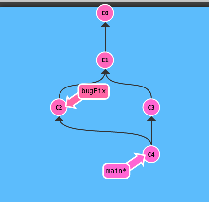

После слияние ветки main в bugFix

> git checkout bugFix

> git merge main

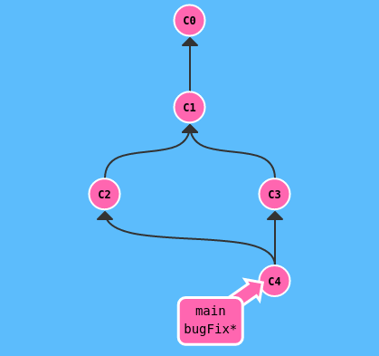

# rebse
#
Исходные данные

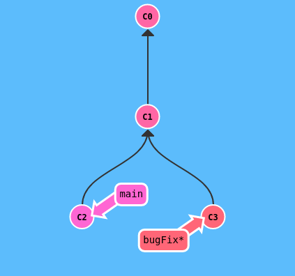

Переносим данные из bugFix в main

> git checkout bugFix

> git rebase main

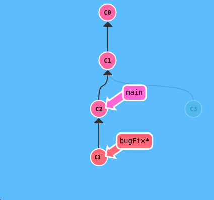

После переносим данные из main в bugFix

> git checkout main

> git rebase bugFix

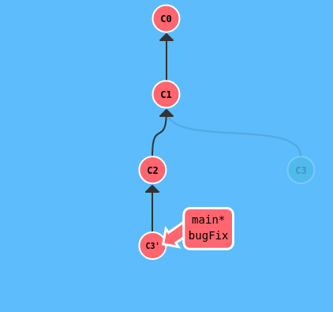

# head deataching
#
Исходные данные

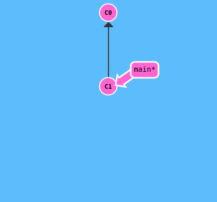

> git checkout C1

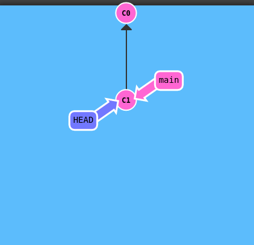

# Относительные ссылки ^
#

Исходные данные

> git checkout main^

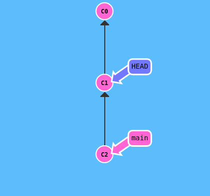

# Относительные ссылки ~
#

Исходные данные

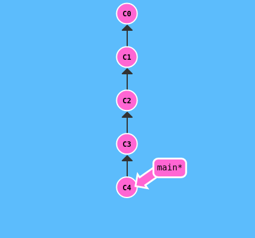

> git checkout HEAD~4

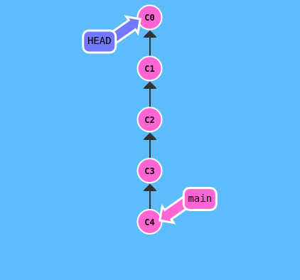

# Перемещение ветки (branch forcing)
#

Исходные данные

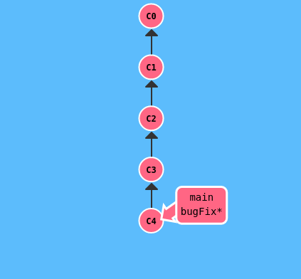

> git branch -f main HEAD~3

Можно прямо в нужны commit

> git branch -f main хэш_коммита

# Отмена изменений в Git - Reset
#

git reset отменяет изменения, перенося ссылку на ветку назад, на более старый коммит. Это своего рода "переписывание истории"; git reset перенесёт ветку назад, как будто некоторых коммитов вовсе и не было.

Исходные данные

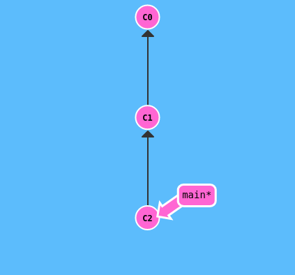

> git reset HEAD~3

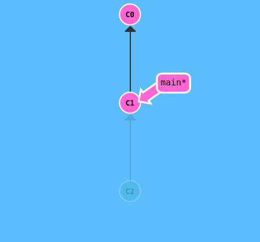

# Отмена изменений в Git - Revet
#

Reset отлично работает на локальных ветках, в локальных репозиториях. Но этот метод переписывания истории не сработает на удалённых ветках, которые используют другие пользователи.

Чтобы отменить изменения и поделиться отменёнными изменениями с остальными, надо использовать git revert. Посмотрим, как это работает

Исходные данные

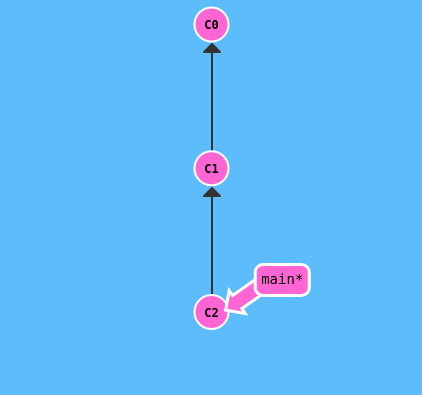

> git revert HEAD

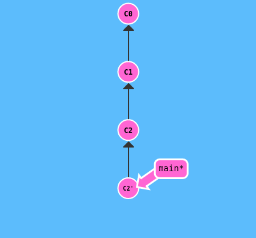

Новый коммит C2' просто содержит изменения, полностью противоположные тем, что сделаны в коммите C2.

После revert можно сделать push и поделиться изменениями с остальными.

# Cherry-pick
#

Копировать несколько коммитов на место, где сейчас находишься (HEAD)

> git cherry-pick <Commit1> <Commit2> <...>

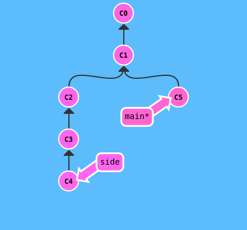

> git cherry-pick C2 C4

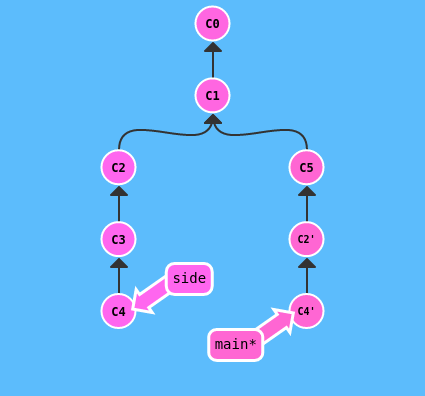

# Git Interactive Rebase
#

Когда точно не известно какие коммиты нужны, использовать интерактивный rebase
Git откроет интерфейс просмотра того, какие коммиты готовы к копированию на цель rebase (target). Также показываются хеши коммитов и комментарии к ним, так что можно легко понять что к чему.

* сменить положение коммита по порядку, переставив строчку с ним в редакторе

* "выкинуть" коммит из ребейза. Для этого есть pick - переключение его означает, что нужно выкинуть коммит.

* соединить коммиты - можно объединять изменения двух коммитов

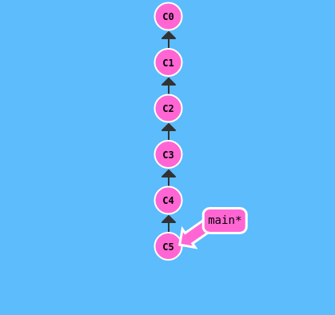

> git rebase -i HEAD~4

Далее правим файл

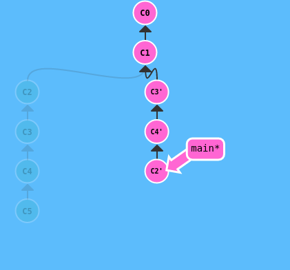

# Добавляем найденный bugFix
#

Ситуация при разработке: пытаемся отследить ошибку, она не очевидна. Мы используем несколько команд для отладки и вывода.

Каждая отладочная команда (команды) вывода находится в своём коммите. В итоге мы нашли ошибку.

Мы хотим добавить в main только исправление ошибки из ветки bugFix

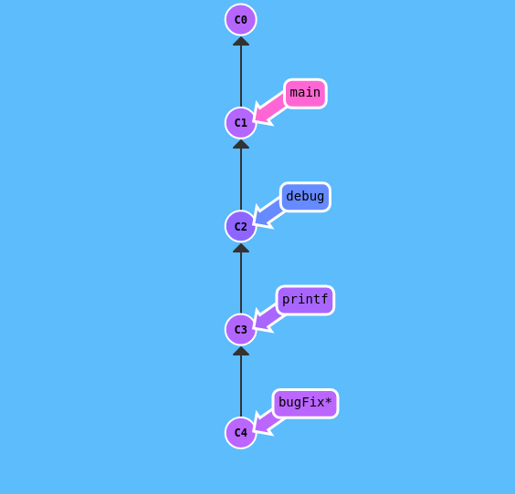

> git checkout main

> git cherry-pick C4

или

> git checkout main

> git rebase -i C1

> git branch -f main C4'

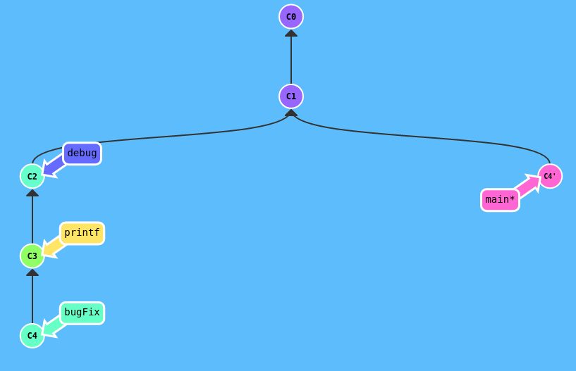

<!---

### Жонглируем коммитами
#

Изменения (newImage) и (caption), связаны так, что находятся друг поверх друга в репозитории.

Нужно внести изменения в более ранний коммит.
Надо поменять newImage, коммит уже в прошлом!

* Переставить коммит так, чтобы нужный находился наверху при помощи git rebase -i

* Внести изменения при помощи git commit --amend

* Переставить всё обратно при помощи git rebase -i

* Переместить main на изменённую часть дерева, чтобы закончить уровень.

Мы дважды перемещаем коммиты, оба они получат по апострофу

Ещё один апостроф добавляется, когда мы делаем git commit --amend.

-->